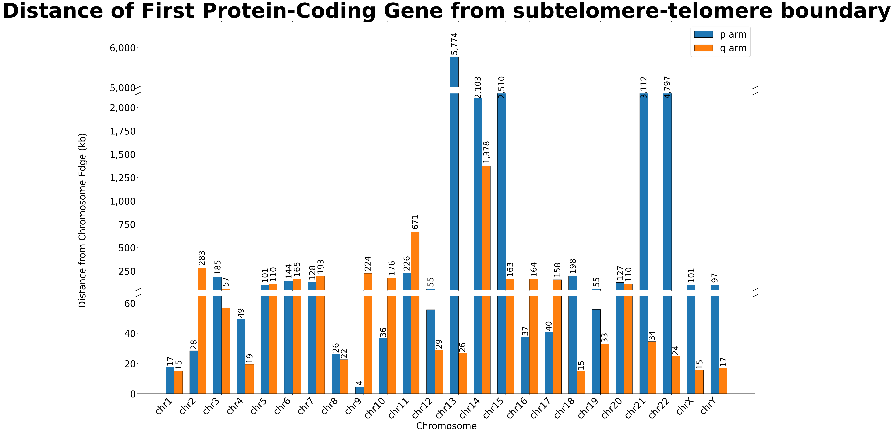
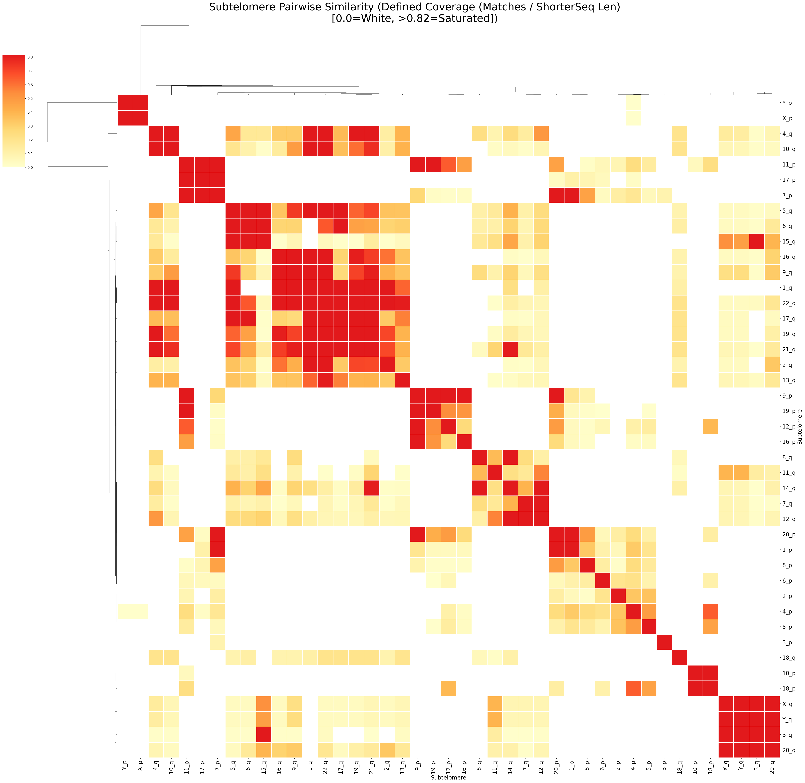

# Subtelomeric Architecture of the Human T2T CHM13v2.0 Reference Genome: Gene Proximity and Pairwise Similarity Across Chromosome Ends

---

## Introduction

Telomeres are repetitive nucleotide sequences (TTAGGG)n that cap the ends of linear chromosomes, protecting them from degradation and end-to-end fusion (Blackburn et al., 2006). Immediately proximal to the telomere is the subtelomeric region: a structurally complex, highly repetitive, and poorly characterized segment that serves as a transition zone between the protective telomere repeat array and the gene-rich chromosome interior. Subtelomeres are enriched in segmental duplications, transposable elements, and gene families, and they display remarkable variation both within and between individuals (Mefford and Trask, 2002). Despite their biological importance—subtelomeric regions are implicated in cancer, aging, and immune gene diversification—they have historically been difficult to sequence and assemble, leaving large gaps in our understanding.

The completion of the Telomere-to-Telomere (T2T) CHM13v2.0 assembly provides, for the first time, a fully gapless representation of the human genome including all subtelomeric regions (Nurk et al., 2022). This reference presents an unprecedented opportunity to systematically characterize the gene content and sequence architecture of human subtelomeres genome-wide. In this project, I address two related questions: (1) How far is the first protein-coding gene from the telomere-subtelomere boundary on each chromosome arm? and (2) How similar are subtelomeric sequences across different chromosome arms, and do they cluster into recognizable families?

---

## Methods

### Reference Data

All analyses used the T2T CHM13v2.0 reference assembly (`chm13v2.0.fa`) with the corresponding RefSeq Liftoff v5.2 gene annotation (`chm13v2.0_RefSeq_Liftoff_v5.2.gff3`). Chromosome lengths were obtained from the FASTA index file (`chm13v2.0.fa.fai`).

### Telomere-Subtelomere Boundary Identification

Telomere-subtelomere boundaries were identified using TeloBP, a tool that locates the precise transition from the TTAGGG repeat array into the unique subtelomeric sequence (Karimian et al., 2023). For each chromosome arm, the relevant terminal FASTA sequences were extracted and provided as input to TeloBP. The resulting BED files specified the coordinate of the boundary between telomeric repeats and the adjacent subtelomeric sequence. This step was parallelized across all chromosome arms using a Python wrapper script (`run_telobp.py`) with up to 64 concurrent workers.

### Extraction of Terminal Protein-Coding Genes

Using `extract_first_last_genes.py`, all gene-level features annotated as `gene_biotype=protein_coding` were extracted from the GFF3 annotation. For each canonical chromosome (chr1–chr22, chrX, chrY), genes were sorted by start position to identify the first (most p-proximal) gene and by end position to identify the last (most q-proximal) gene. The distance from each terminal gene to the nearest chromosome edge was computed as:

- **p arm**: distance = gene start − 1 (0-based distance from chromosome start)
- **q arm**: distance = chromosome length − gene end

These raw edge distances were then corrected by subtracting the telomere length as determined by TeloBP, yielding the distance from the telomere-subtelomere boundary to the first (or last) protein-coding gene. Results were written to a tab-delimited summary file and a filtered GFF3.

### Visualization of Subtelomere Gene Distances

Distances were visualized using `plot_broken_axis.py`, which produces a grouped bar chart with a three-section broken Y-axis to accommodate the wide dynamic range of distances (from ~4 kb to ~5,774 kb). The three sections span 0–50 kb (bottom), 50–1,850 kb (middle), and 5,000–6,100 kb (top), with diagonal break indicators between panels. P-arm and q-arm distances for each chromosome are shown as adjacent bars (blue and orange, respectively), and numeric labels are placed above each bar.

### All-vs-All Subtelomere Sequence Comparison

Subtelomere sequences for each chromosome arm were extracted from the reference genome based on TeloBP boundary coordinates and assembled into a multi-FASTA file. Acrocentric p arms containing rDNA arrays (chr13p, chr14p, chr15p, chr21p, chr22p) were excluded from comparative analysis because their rDNA content dominates alignment signals and obscures subtelomere-specific similarity.

Sequences were oriented uniformly in the telomere→centromere direction using `orient_sequences.py`. P-arm sequences were kept in their original orientation; q-arm sequences were reversed (same strand, reversed order) so that all sequences are anchored at the telomeric end. This orientation allows alignment programs to identify positionally equivalent features across arms.

All-vs-all pairwise alignment was performed with minimap2 v2.24 using the `asm20` preset, which is suited for divergent assemblies (up to ~20% sequence divergence):

```bash
minimap2 -x asm20 -X -c -N 10000 -t 64 \
    arm_sequences_oriented_no_rdna.fa \
    arm_sequences_oriented_no_rdna.fa \
    > subtelomere_allvsall.paf
```

The `-X` flag suppresses self- and dual alignments to avoid redundancy. The PAF output was parsed with `plot_heatmap.py`, which computed three similarity metrics for each pair:

- **Coverage** (alignment length / shorter sequence length)
- **Defined coverage** (matching bases / shorter sequence length)
- **Coverage-long** (matching bases / longer sequence length)

Similarity matrices were hierarchically clustered using scipy's default linkage method and visualized as clustered heatmaps via seaborn's `clustermap`. A circos-style circular plot was also generated (`plot_circos_individual.py`) to display pairwise connections between arms scaled by similarity.

---

## Results

### Highly Variable Distances from Telomere to First Protein-Coding Gene

The distance from the telomere-subtelomere boundary to the nearest protein-coding gene varies dramatically across chromosome arms (Figure 1). The majority of arms harbor a protein-coding gene within 50–300 kb of the telomere boundary, consistent with the compact organization expected of fully assembled subtelomeres. The median distance across all arms is approximately 100 kb.

However, several chromosome arms are striking outliers. The p arm of chromosome 13 has the longest distance at **5,774 kb** (~5.8 Mb), followed by chrY (**4,797 kb**), chr22p (**3,112 kb**), chr15p (**2,510 kb**), and chr14p (**2,103 kb**). The arms with the shortest distances include chr8p (**4 kb**), chr9q (**36 kb**), and chr1 (**15–17 kb** on both arms).

**Figure 1.** Distance of the first protein-coding gene from the subtelomere-telomere boundary for each chromosome arm in CHM13v2.0. Blue bars = p arm; orange bars = q arm. Y-axis is broken to accommodate outliers. Values in kilobases (kb).



The acrocentric chromosomes (chr13, chr14, chr15, chr21, chr22) are notable: their p arms carry large ribosomal DNA (rDNA) arrays (Stults et al., 2008), which are transcribed but do not encode proteins. The large distances observed for chr13p, chr14p, chr15p, and chr22p are therefore explained by the intervening rDNA spanning several megabases before the first protein-coding gene. Similarly, the chrY p arm contains extensive satellite and repeat arrays in the pseudoautosomal region boundary.

### Subtelomere Sequences Form Similarity Clusters Independent of Chromosomal Identity

All-vs-all alignment of 44 oriented subtelomere sequences (excluding acrocentric p arms with rDNA) produced a pairwise similarity matrix that was hierarchically clustered and visualized as a heatmap (Figure 2). Three distinct similarity metrics—coverage, defined coverage, and coverage-long—were evaluated, all showing consistent clustering patterns.

**Figure 2.** Clustered heatmap of pairwise subtelomere similarity across chromosome arms. Color scale represents defined coverage (matching bases / shorter sequence length). Warm colors indicate higher similarity; white indicates no detectable alignment.



The heatmap reveals several subtelomere "families"—groups of chromosome arms with markedly higher mutual similarity than to other arms. These clusters do not correspond to a simple rule of same chromosome or nearby genomic location, consistent with the known transpositional history of subtelomere blocks (Linardopoulou et al., 2005). Many chromosome arms share sequence identity with three or more other arms, suggesting repeated duplication and exchange events distributed across the karyotype.

A circos plot (Figure 3) further illustrates these inter-arm relationships, drawing arcs between pairs of arms scaled to their alignment similarity. The most heavily connected nodes represent arms that participate in multiple subtelomere-sharing relationships.

**Figure 3.** Circos-style plot of subtelomere pairwise similarity. Each node represents one chromosome arm; arc thickness is proportional to pairwise alignment coverage.


---

## Discussion

This analysis leverages the completeness of the T2T CHM13v2.0 assembly to provide the first fully gapless, genome-wide survey of terminal gene positioning and subtelomere sequence similarity in the human genome. Two principal findings emerge.

**First**, the distance from the telomere to the first protein-coding gene is highly heterogeneous, ranging from ~4 kb (chr8p) to ~5.8 Mb (chr13p). The extreme outliers on acrocentric p arms are biologically explained by rDNA arrays that occupy megabases between the telomere and any protein-coding sequence. The chrY outlier likely reflects the abundance of repetitive sequences and the comparatively sparse gene content of the male sex chromosome. For most autosomes and chrX, distances of 15–300 kb suggest that subtelomeric gene-poor regions are relatively compact, with protein-coding genes beginning promptly after the transition zone. This has implications for subtelomeric deletion syndromes: rearrangements that truncate chromosomes near these boundaries may spare or disrupt specific gene subsets depending on where the break occurs.

**Second**, all-vs-all minimap2 alignment confirms that subtelomere sequences are shared in a complex, non-syntenic pattern across chromosome arms. The hierarchical clustering of the similarity matrix identifies cohesive subtelomere families, consistent with the longstanding model of inter-chromosomal subtelomere exchange through ectopic recombination (Mefford and Trask, 2002). These results underscore that subtelomere blocks behave as mobile genomic elements that have been duplicated and shuffled throughout the human karyotype, making their annotation and interpretation substantially more complex than the rest of the genome.

Taken together, these findings demonstrate that even within a single reference genome, subtelomeric architecture is far from uniform. Future work could extend this analysis to population-level assemblies to characterize subtelomere length and sequence variation across individuals, or to other great ape genomes to reconstruct the evolutionary history of subtelomere block transfers.

---

## References

Blackburn, E.H., Greider, C.W., and Szostak, J.W. (2006). Telomeres and telomerase: the path from maize, Tetrahymena and yeast to human cancer and aging. *Nature Medicine*, 12(10), 1133–1138.

Karimian, K., Groot, A., Huso, V., Kahidi, R., Tan, K. T., Sholes, S., Keener, R., McDyer, J. F., Alder, J. K., Li, H., Rechtsteiner, A., & Greider, C. W. (2023). Human telomere length is chromosome specific and conserved across individuals. *bioRxiv* (preprint). https://doi.org/10.1101/2023.12.21.572870

Linardopoulou, E.V., et al. (2005). Human subtelomeres are hot spots of interchromosomal recombination and segmental duplication. *Nature*, 437(7055), 94–100.

Mefford, H.C., and Trask, B.J. (2002). The complex structure and dynamic evolution of human subtelomeres. *Nature Reviews Genetics*, 3(2), 91–102.

Nurk, S., et al. (2022). The complete sequence of a human genome. *Science*, 376(6588), 44–53.

Stults, D.M., et al. (2008). Genomic architecture and inheritance of human ribosomal RNA gene clusters. *Genome Research*, 18(1), 13–18.
