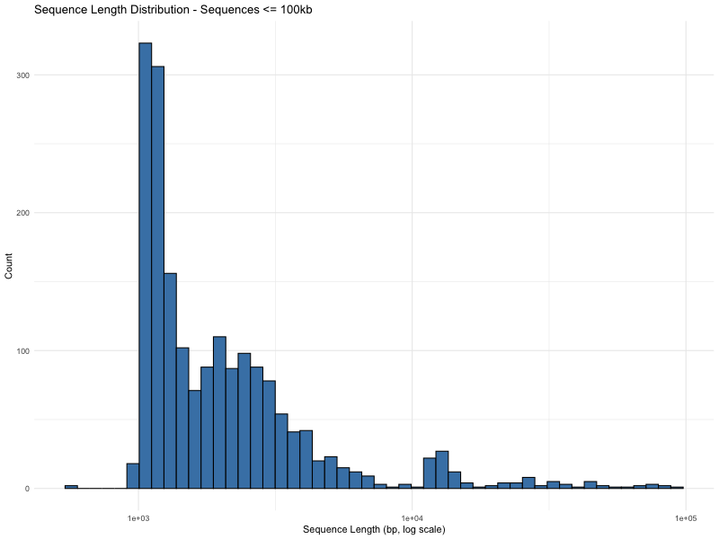
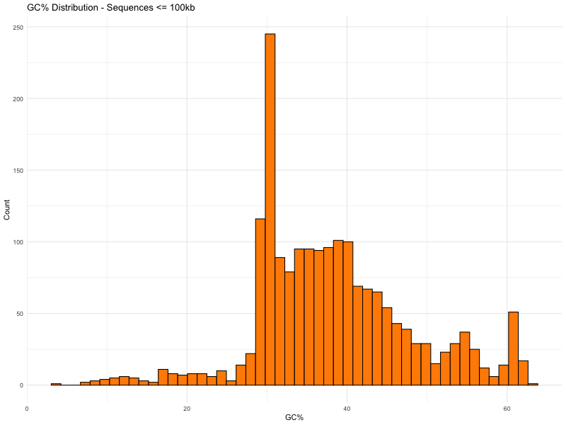
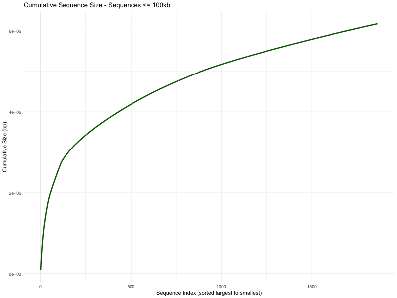
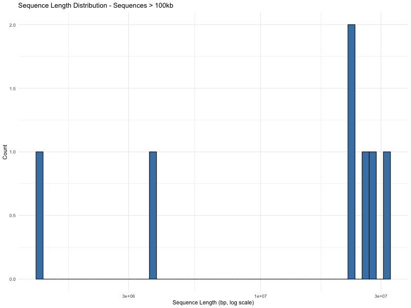
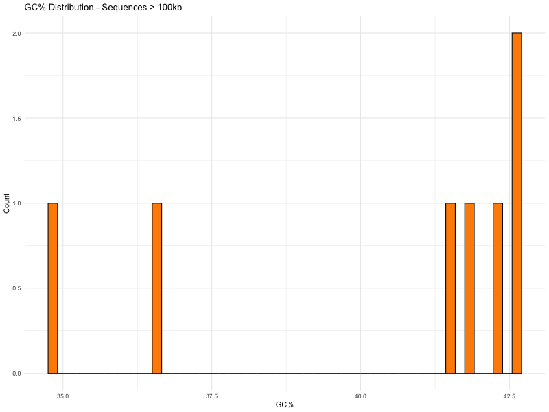
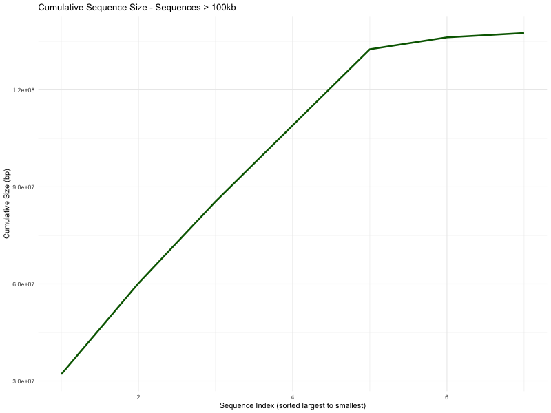
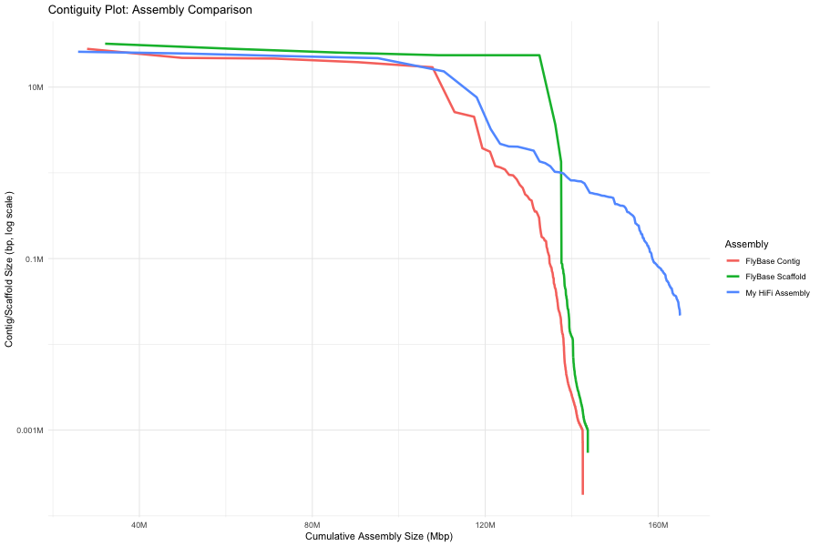

# Homework 4: Genome Assembly and Assessment

## Data Source
- FlyBase release: `dmel_r6.66_FB2025_05`
- Genome FASTA: `dmel-all-chromosome-r6.66.fasta.gz`
- HiFi reads: `/pub/jje/ee282/ISO_HiFi_Shukla2025.fasta.gz` (HPC3)

## Scripts
1. `code/scripts/hw4_genome_summary.sh` — Partition genome and compute summaries
2. `code/scripts/hw4_genome_plots.sh` — Generate 6 plots for both partitions
3. `code/scripts/hw4_assembly.sh` — Assemble genome with hifiasm (HPC3)
4. `code/scripts/hw4_assembly_assessment.sh` — N50, contiguity plot, BUSCO (HPC3)

---

## Part 1: Genome Partition Summary

Sequences were partitioned at 100kb using `bioawk`:

```bash
bioawk -c fastx '{
    len = length($seq);
    ns  = gsub(/[Nn]/, "", $seq);
    if (len <= 100000) print "le100kb", len, ns;
    else               print "gt100kb", len, ns;
}' <(gunzip -c dmel-all-chromosome-r6.66.fasta.gz)
```

### Results

| Partition | Total Nucleotides | Total Ns | Total Sequences |
|-----------|------------------:|---------:|----------------:|
| <= 100kb  | 6,178,042         | 662,593  | 1,863           |
| > 100kb   | 137,547,960       | 490,385  | 7               |

The vast majority of the genome (137.5 Mb, ~96%) is in just 7 large sequences (chromosome arms + mitochondrial), while 1,863 small sequences account for only ~6.2 Mb.

---

## Part 2: Genome Partition Plots

All plots generated with `bioawk` + R/ggplot2. See `code/scripts/hw4_genome_plots.sh`.

### Sequences <= 100kb

#### Sequence Length Distribution


Most small sequences are 1-3 kb in length, with a long tail extending to ~100 kb. Log scale reveals the distribution spans ~2 orders of magnitude.

#### GC% Distribution


GC content is broadly distributed, with a peak around 30-35% and a secondary concentration around 40-45%.

#### Cumulative Sequence Size


The curve shows a gradual increase — no single small sequence dominates this partition.

### Sequences > 100kb

#### Sequence Length Distribution


Only 7 sequences, ranging from ~1.3 Mb to ~32 Mb, corresponding to the major chromosome arms.

#### GC% Distribution


GC content clusters between 35-43%, consistent with known Drosophila chromosome arm GC content.

#### Cumulative Sequence Size


The 7 large sequences account for ~137.5 Mb total. The step-like pattern reflects the chromosome arm sizes.

---

## Part 3: Genome Assembly

HiFi reads were assembled using `hifiasm` on HPC3. See `code/scripts/hw4_assembly.sh`.

```bash
hifiasm -o dmel_hifi -t 16 -l0 ISO_HiFi_Shukla2025.fasta.gz
```

The `-l0` flag was used because the ISO-1 strain is inbred/homozygous. Primary contigs were extracted from `*.bp.p_ctg.gfa`:

```bash
awk '/^S/{print ">"$2; print $3}' dmel_hifi.bp.p_ctg.gfa > dmel_hifi.bp.p_ctg.fa
```

### Assembly Results

| Metric | Value |
|--------|------:|
| Total assembly size | 165,064,926 bp |
| Number of contigs | 199 |
| N50 | 21,715,751 bp (~21.7 Mb) |
| Largest contig | 25,826,298 bp (~25.8 Mb) |

The assembly produced 199 contigs totaling ~165 Mb, with an N50 of ~21.7 Mb. The largest contigs correspond to chromosome arms, with several exceeding 20 Mb.

---

## Part 4: Assembly Assessment

See `code/scripts/hw4_assembly_assessment.sh`.

### N50 Comparison

| Assembly | N50 | Total Size | # Contigs/Scaffolds |
|----------|----:|----------:|--------------------:|
| My HiFi Assembly | 21,715,751 bp | 165,064,926 bp | 199 |
| FlyBase Scaffold | 25,286,936 bp | 143,726,002 bp | 1,870 |
| FlyBase Contig | 21,485,538 bp | 142,573,024 bp | 2,442 |

My HiFi assembly N50 (21.7 Mb) is comparable to the FlyBase contig N50 (21.5 Mb) and only slightly below the scaffold N50 (25.3 Mb). The total assembly size is ~165 Mb, which is larger than the reference (~144 Mb), likely due to additional heterozygous/repetitive contigs retained in the assembly.

### Contiguity Plot



The contiguity plot compares cumulative assembly size vs. contig/scaffold size for:
- My HiFi assembly
- FlyBase contig assembly
- FlyBase scaffold assembly

The HiFi assembly tracks closely with the FlyBase scaffold assembly for the largest sequences, demonstrating that long HiFi reads produce highly contiguous assemblies. The drop-off at higher cumulative sizes reflects small contigs from repetitive or heterozygous regions. The FlyBase scaffold assembly maintains large scaffold sizes longer due to scaffolding across gaps, while the FlyBase contig assembly drops off earlier as expected.

### BUSCO Scores

BUSCO was run with `diptera_odb10` lineage dataset (n=3,285):

| Assembly | Complete | Single-copy | Duplicated | Fragmented | Missing |
|----------|----------|-------------|------------|------------|---------|
| My HiFi Assembly | 100.0% (3,284) | 99.7% (3,276) | 0.2% (8) | 0.0% (0) | 0.0% (1) |
| FlyBase Reference | 99.9% (3,283) | 99.7% (3,274) | 0.3% (9) | 0.0% (0) | 0.1% (2) |

Both assemblies achieve near-perfect BUSCO completeness. The HiFi assembly actually matches or slightly exceeds the FlyBase reference, with 100.0% complete BUSCOs vs. 99.9%. This demonstrates the high quality of the HiFi assembly for gene content representation.
